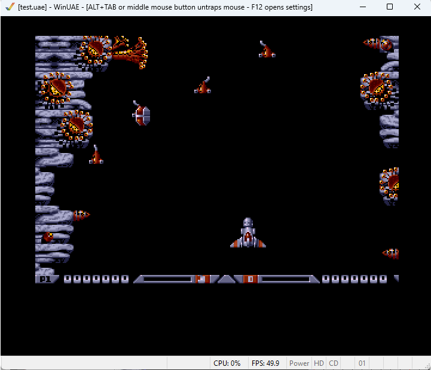
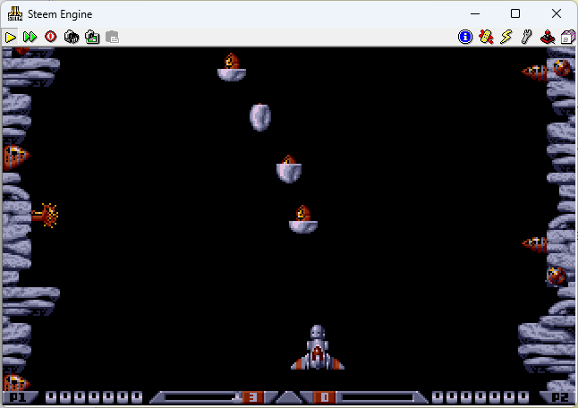
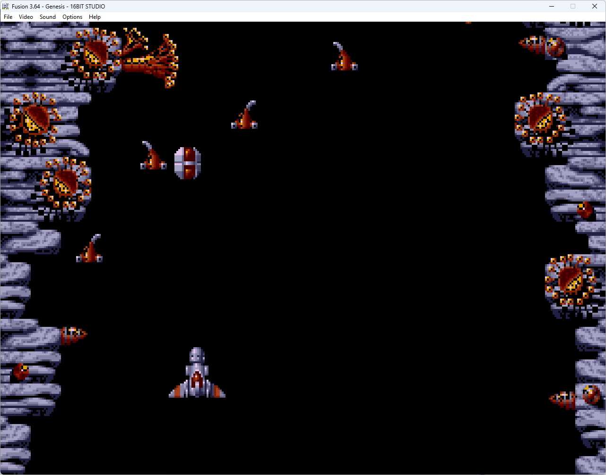

# About
16 Bit-Studio is a game engine for Amiga, Atari-ST and Sega-Genesis (Mega Drive). Only vertical scrollers are supported in the first version. However, side scrollers are already in the works. 

The engine generates assembler code so that developers can add unsupported features themselves.

# How To Start:

- Java 1.8+ is needed
- Download the entire project
- click on Start.bat

# Included/Used Software:

- VASM assembler
- STEEM Atari ST Emulator http://steem.atari.st/
- WinUAE Amiga Emulator https://www.winuae.net/
- SNDH Player http://bulba.untergrund.net/emulator_e.htm
- HAM Converter http://mrsebe.bplaced.net/blog/wordpress/?page_id=374 
  
# Demo Xenon

The first demo includes a level of Xenon II. Unlike the original, there is no parallax scroll level. The demo shows how to implement enemy formations. There are extra weapons and pots. 

Amige Version:

Atari ST Version:

Sega Genesis Version

- no Sound
- no Footer
- no Scripts